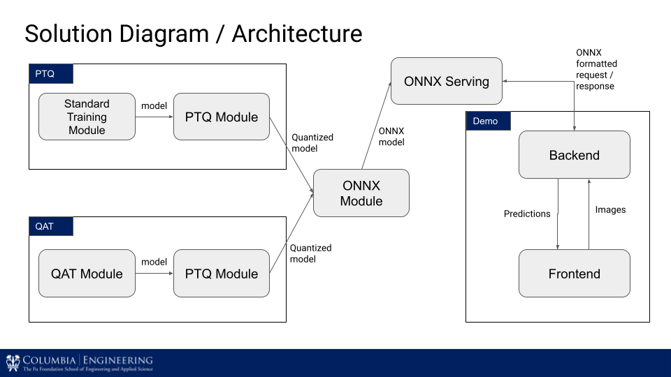
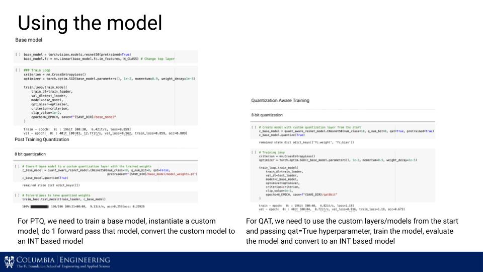

# 4-bit Quantization Model on Image Classification

Name: Praditya Raudi Avinanto and Rifqi Luthfan
UNI: pra2118 and rl3154

This repository contains the final project for COMS 6998 Practical Deep Learning System Performance
# Project Description

Quantization is one of the techniques to reduce model size and computational complexity which can then be implemented in edge devices (Mobile Phones, IoT devices). However, PyTorch and Tensorflow supports only 8-bit integer quantization currently.

In this project, we explore converting a 32-bit float neural network (NN) model into a precision lower than 8-bit integer NN model.

1. We experimented using 8,7,6,5,4 bits quantization for two models (ResNet-18 and ResNet-50) for two datasets (CIFAR10 and ImageNette)
2. We experimented both Post Training Quantization and Quantization Aware Training

We found the different effect of each model responding to different bitwidth quantization


# Respository Content

## Pytorch Quantization Module
For the web server part, refer to these repo: [Front End Module](https://github.com/raudipra/front_end_quantization_project) and [Back End Quantization Project](https://github.com/raudipra/back_end_quantization_project).

This repository contains Resnet Quantization implentation in Pytorch, and currently supports Post Training Quantization (PTQ), and Quantization Aware Training (QAT).

## Solution Diagram / Architecture


## Setup
- Launch Deep Learning VM in Google Cloud Platform [Deploy VM Image](https://console.cloud.google.com/marketplace/product/click-to-deploy-images/deeplearning)
    - The Hardware that we used in this project is NVIDIA Tesla V100 GPU with 8 vCPU 30gb RAM (n1-standard-8 GCP)
- Install additional libraries
    - `pip install -r requirements.txt`

The code used for this project is contained in the following notebooks and python files:

## Source Codes

We implemented custom Convolutional, Batch Normalization, Relu, Linear, and Addition Layers differently for PTQ and QAT. All PTQ weights & activation outputs are already in integers while QAT has FakeQuant and QParam. PTQ Modules also contains quantization model conversion that can convert the weights and activations from a saved PyTorch model.

Under ```quantization_functions``` folder, we have:

QAT Modules:

1. quant_aware_layers.py
    1. Contains custom layers: CONV, BN, RELU, LINEAR, ADD
    2. Utilizes PyTorch module register buffer in `QParam` to keep quantization parameters
    3. `FakeQuantize` Function is used to simulate quantization loss during training
    4. `fold_bn` is used to replace Convolution + Batch Normalization layers by only one Convolution with different weights
    5. Here, the parameters are still in float32

2. quant_aware_resnet_model.py
    1. Contains Basic and Bottleneck blocks of Resnet model utilizing custom layers created
    2. Resnet-18, Resnet-34, Resnet-50, Resnet-101, Resnet-152 is implemented, but we only compared Resnet-18 and Resnet-50 in our experiments


PTQ Modules:

3. post_training_quant_layers.py
    1. Contains custom layers: CONV, BN, RELU, MAXPOOL, AVG_POOL, LINEAR, ADD
    2. Here, the parameters are already in integers
    3. Have a method that can convert existing weights to quantized model

4. post_training_quant_model.py
    1. Utilizes the PTQ layers to create quantized Resnet model
    2. Parameters are also already in integers
    3. Also have a method that can convert existing weights to quantized model

Utils:

5. train_loop.py -> custom training loop and validation loop utilizing `tqdm` library
6. generate_onnx.py -> generate ONNX model from PyTorch model

## Notebooks

Example of model and quantization functions usage in notebook:


Under the main folder, we have several notebooks for the experiments that we do:

For experiments using different dataset and different model, we use different notebooks and named it based on {dataset}-{model}.ipynb naming:

1. CIFAR10-ResNet18.ipynb
2. CIFAR10-ResNet50.ipynb
3. ImageNette-ResNet18.ipynb
4. ImageNette-ResNet50.ipynb

In each of those 4 notebooks, we trained full precision 32 bit, Post Training Quantization 8,7,6,5,4 bit, and Quantization Aware Training 8,7,6,5,4 bit.

And lastly, we have the compiled analysis for comparing metrics & charts in:

5. Analysis-of-results.ipynb

## ONNX Runtime Serving

### Generate ONNX Model
- `python -m quantization_functions.generate_onnx.py`

### Setup Server
- Clone the repo
- Download the [ONNX models](https://drive.google.com/drive/folders/1-Mc2gVb5yMWstdlm-MKFF3sgPEoFIxne?usp=sharing) and keep it under `pytorch-quantization/checkpoint/onnx/imagenette/`

### Run Server
- `sudo docker pull mcr.microsoft.com/onnxruntime/server`
- `sudo docker run -it -v $(pwd):$(pwd) -p 9001:8001 mcr.microsoft.com/onnxruntime/server --model_path $(pwd)/pytorch-quantization/checkpoint/onnx/imagenette/resnet50_4bit.onnx`
- You can choose the model by changing the `--model_path` argument above.